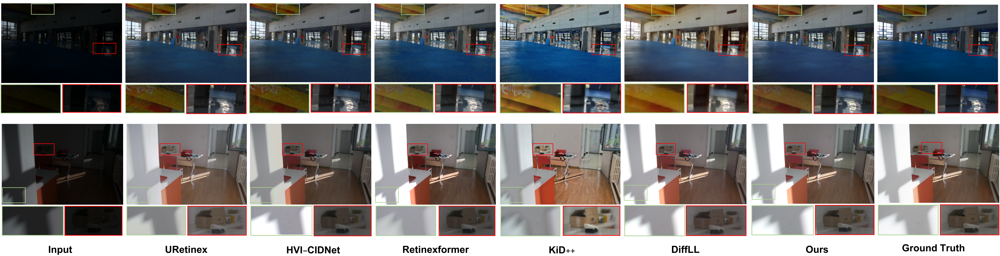
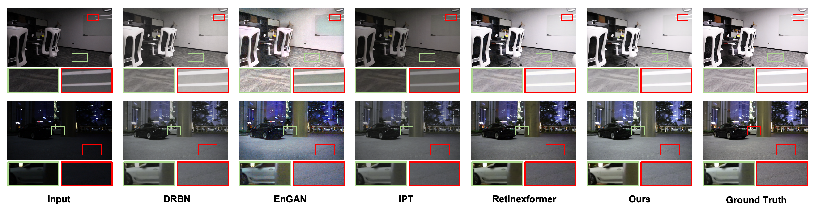
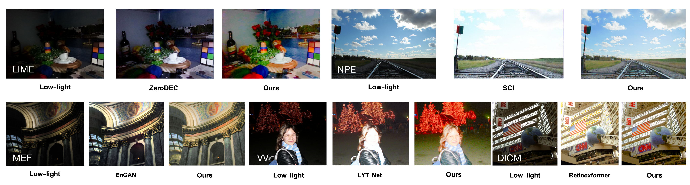

&nbsp;
# LLEN-Net
A Transformer-Enhanced Dual-Channel Fourier Framework for Low-Light Image Restoration


## 💡 News 新闻

- **2024.10.11** The first draft is complete.
- **2024.10.03** Start with ablation and target detection tests.
- **2024.10.03** For the SID, SMID, SDSD data sets, we reworked these data sets.
- **2024.09.15** Make changes to the network structure and start testing different training sets.
- **2024.09.03** 🌟 The first version completed training and testing. The input conversion to LAB is done in this version. Good results were achieved.
- **2024.08.19** The initial model was completed.
- **2024.07.08** project startup 🎈


## ⚙ module 模型组件


## 🖼 Visual Comparison 视觉比较








## 🧾 Weights and Results 

### Ours

#### LTCF-Net
| Folder (test datasets) | PSNR       	 | SSIM       | LPIPS      | Results       | Weights Path   |
| ------------------ | -----------		 | ---------- | ---------- 	| ------- 		| ----------- | 
| LOLv1<br />   | 26.49    	 |  0.85  | ** |  **    |          | LOLv1.pth         |
| LOLv2<br />   | 29.76    	|  0.92   | **  | **    |          | LOLv2.pth         |
| SID<br />   | 26.28    	|  0.70   | **  | **    |          | sid.pth         |
| SMID<br />    | 28.83    	|  0.75   | **  | **    |          | smid.pth         |
| SDSD-in<br />   | 29.98    	|  0.89   | **  | **    |          | in.pth         |
| SDSD-out<br />   | 30.14    	|  0.87   | **  | **    |          | out.pth         |


#### LTCF-net*
| Folder (test datasets) | PSNR       	 | SSIM       | LPIPS      | Results       | Weights Path   |
| ------------------ | -----------		 | ---------- | ---------- 	| ------- 		| ----------- | 
| LOLv1<br />    | 26.28    	 |  0.83   | ** |  **    |          | LOLv1.pth         |
| LOLv2<br />    | 30.11    	|  0.93   | **  | **    |          | LOLv2.pth         |
| SID<br />   | 25.26    	|  0.68   | **  | **    |          | sid.pth         |
| SMID<br />    | (29.23)    	|  (0.86)   | **  | **    |          | smid.pth         |
| SDSD-in<br />   | 29.27    	|  0.80   | **  | **    |          | in.pth         |
| SDSD-out<br />   | -    	|  -   | **  | **    |          | out.pth         |

### Training log
|   Model name      |           comment			 |  
| ----------------- | ------------------------ |
| **LTCF-Net**       |    epoch:1500    			|     
| **LTCF-Net***       |    epoch:1500    			|    


### check log

Log files are stored in `./Compare_models/ different models/ LOLv1/info`

## 🌑 0. My environment

- Ubuntu 20.04.6
- Intel(R) Xeon(R) Platinum 8350C CPU
- A30-24G * 1
- RAM 85G

## 🌑 1. Get Started 

- Python 3.9
- pytorch-cuda=11.8

(1) Create Conda Environment

```bash
conda create --name LTCF python=3.9 -y
conda activate LTCF
```

(2) Clone Repo

```bash
git clone https://github.com/suiuko/LTCF-Net.git
```

(3) Install Dependencies

```
conda install pytorch torchvision torchaudio pytorch-cuda=11.8 -c pytorch -c nvidia

pip install matplotlib scikit-learn scikit-image opencv-python yacs joblib natsort h5py tqdm tensorboard

pip install einops gdown addict future lmdb numpy pyyaml requests scipy yapf lpips thop timm torchmetrics pytorch_msssim
```

or:
```bash
cd LTCF
pip install -r requirements.txt
```

### Data Preparation

Currently only the LOLv1 database is tested

- [LOLv1](https://daooshee.github.io/BMVC2018website/)

Note: 
(1) For the SID, SMID, SDSD data sets, we reworked these data sets. Convert the `.npy` file to an RGB file, which can be downloaded if you want to use the reconstructed data set.

<details open> <summary>datasets (click to expand)</summary>
  
```
├── datasets
	├── DICM
	├── LIME
	├── LOLdataset
		├── Train
			├──low
			├──high
		├── Test
			├──low
			├──high

```
</details>

## 🌒 2. Testing 

## 🌒 3. Training  

```bash
# activate the enviroment
conda activate LTCF

# LOL-v1
python3 train.py 

```
